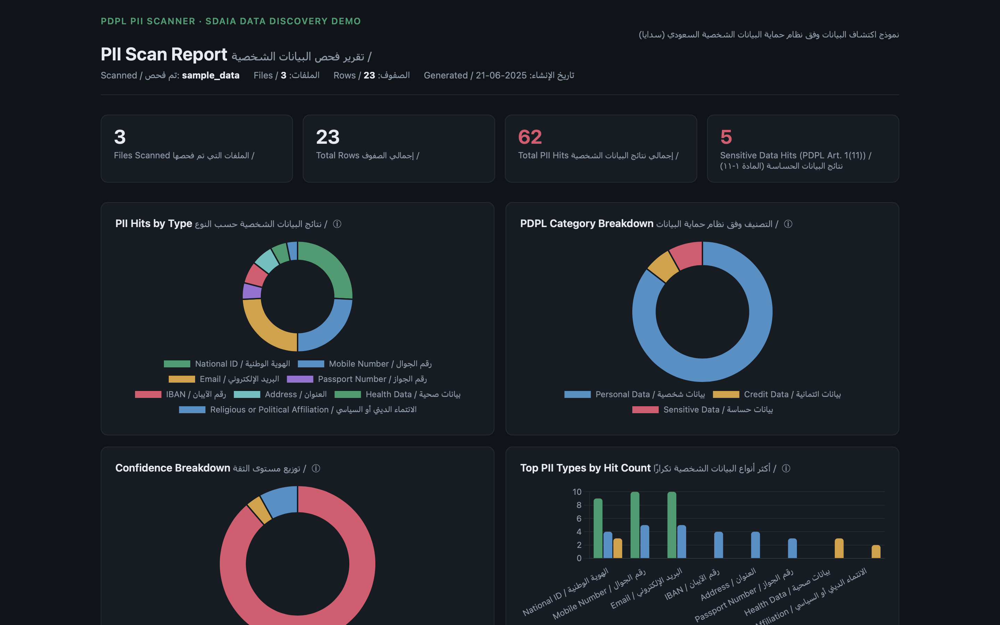
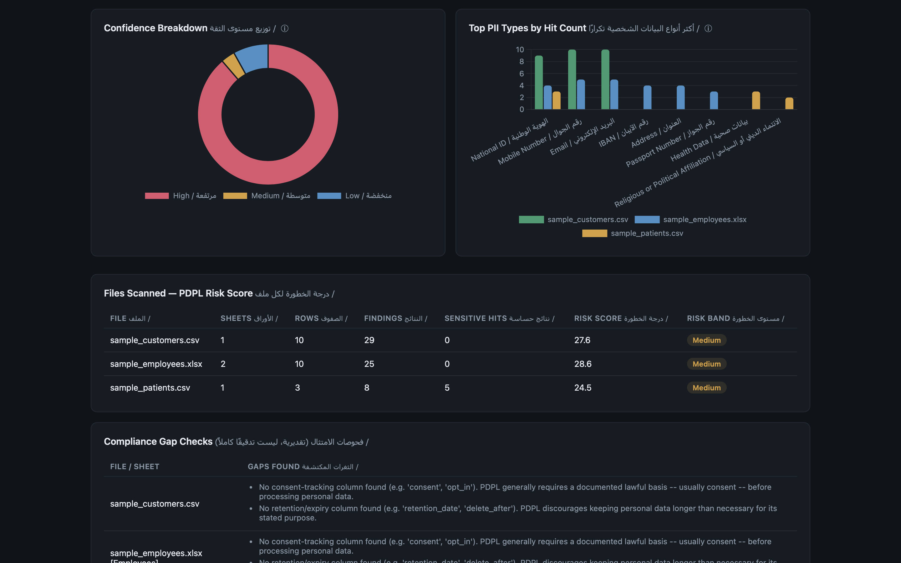
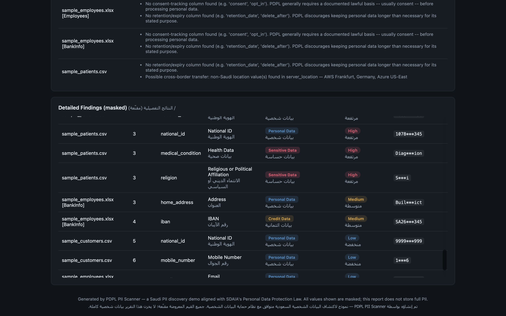

# pdpl-pii-scanner

A Python tool that scans CSV/Excel files for Saudi PII (National ID, mobile number, IBAN, passport, email, address, health, and religious/political data), classifies each finding under Saudi Arabia's **PDPL** (Personal Data Protection Law, overseen by **SDAIA**), and produces a risk-scored, bilingual (EN/AR) HTML report — plus optional redacted copies of the source files.

It started as a simple regex-based PII scanner and grew into a small compliance-readiness tool: it doesn't just find data that *looks* personal, it tells you what PDPL actually requires for what was found, and flags governance gaps (missing consent tracking, cross-border data transfer) around it.

```bash
pip install -r requirements.txt
python pdpl_checker.py sample_data --outdir output --redact --explain
```

---

## Preview





---

## What it detects, and how PDPL classifies it

| PII Type | PDPL Category | Why |
|---|---|---|
| Saudi National ID / Iqama | Personal Data | Identifies a person, but isn't in PDPL's Sensitive Data list |
| Saudi Mobile Number | Personal Data | Same |
| Passport Number | Personal Data | Same |
| Email Address | Personal Data | Same |
| Physical Address | Personal Data | Same |
| IBAN / Bank Account | **Credit Data** | PDPL Article 24 gives financial/credit data its own special protections |
| Health / Medical Data | **Sensitive Data** | PDPL Article 1(11) — health data is explicitly listed |
| Religious or Political Affiliation | **Sensitive Data** | PDPL Article 1(11) — explicitly listed |

**This distinction is the whole point of the classification layer.** PDPL Article 1(11) defines Sensitive Data narrowly — race/ethnicity, religious/political/intellectual belief, security-related criminal records, biometric/genetic data, health data, and unknown-parentage data. Everything else that identifies a person (names, ID numbers, contact info) is ordinary Personal Data: still protected, but without the extra explicit-consent and DPIA requirements that apply specifically to Sensitive Data.

> **Accuracy note:** this classification is built from PDPL Article 1's defined terms and public SDAIA/law-firm guidance (sources listed in `pdpl_knowledge.py`). It's an educational summary for a portfolio tool, not legal advice — confirm against the official PDPL text and Implementing Regulations before relying on it for real compliance decisions.

## How detection works

Each detector layers three signals into a confidence score (**High / Medium / Low**) rather than a flat yes/no:

1. **Regex pattern match** — does the value's format match the PII type?
2. **Validation rules** — does it pass extra checks (IBAN mod-97 checksum, placeholder-digit rejection for National IDs, medical/religious keyword cues)?
3. **Column name hints** — does the column header suggest PII, even if content doesn't cleanly match?

Detectors live in `pii_detectors.py` as a registry of small classes — adding a new PII type means adding one class, no changes needed elsewhere.

## Risk scoring

Each finding gets a **risk weight**: `category_weight × confidence_multiplier`.

- Personal Data = weight 1, Credit Data = weight 3, Sensitive Data = weight 5 (reflecting PDPL's own stricter rules for these categories)
- Confidence scales it down: High ×1.0, Medium ×0.6, Low ×0.3

These sum into a **per-file risk score**, banded as None / Low / Medium / High / Critical. The intent: a file with a handful of phone numbers and a file with health records mixed with National IDs should *not* look equally risky in a report, even if their raw finding counts are similar.

## Compliance gap checks (heuristic)

Beyond "what PII exists," the tool checks for governance signals PDPL cares about:

- **Consent / retention columns** — does the file have anything resembling a `consent`/`opt_in` column, or a `retention_date`/`delete_after` column? If not, that's flagged — PDPL requires a lawful basis (usually consent) and discourages indefinite retention.
- **Cross-border transfer indicators** — does the file have a `country`/`server_location`/`hosted_in`-style column, and do any of its values point outside Saudi Arabia? PDPL restricts transferring personal data abroad unless specific safeguards apply.

These are intentionally simple, column-name-driven heuristics — not a substitute for a real audit — but they demonstrate the *kind* of question a PDPL-aware reviewer asks beyond pure PII detection.

## `--explain` flag

Run with `--explain` to get plain-language PDPL obligations grouped by category, e.g. what "Sensitive Data" actually requires (explicit consent, no use for marketing even with consent, possible DPIA) versus ordinary Personal Data. Useful for understanding *why* something was flagged, not just *that* it was.

## Privacy by design

Reports never display full PII — values are masked (`1023456789` → `1023***789`). **Redaction mode** (`--redact`) goes further: flagged cells in output copies are replaced entirely with `[REDACTED]`, for both CSV and multi-sheet XLSX. Non-PII columns (including compliance-relevant metadata like `server_location`, which is needed to see cross-border findings) are preserved.

## Outputs

1. **Console report** — findings by PDPL category, by type, by confidence; per-file risk scores; compliance gaps; optional `--explain` text.
2. **`pii_findings.csv`** — row-level findings with PDPL category and risk weight columns.
3. **`pii_report.html`** — bilingual (English/Arabic) interactive dashboard: PII-by-type, PDPL category breakdown, confidence breakdown, top PII types grouped by file, per-file risk score table, compliance gap panel, detailed findings. Hovering a chart heading (ⓘ icon) or a chart data point shows a plain-language explanation of what it means.
4. **`redacted/`** (with `--redact`) — sanitized copies of every scanned file.

These four are generated fresh each run, inside `output/` (gitignored — see [Project structure](#project-structure)). Separately, **[`REPORT.md`](REPORT.md)** in the repo root is a one-time written report combining a project write-up with the actual results from scanning `sample_data/` — useful if you want to read what the tool found without running it yourself.

## Usage

```bash
# Scan a single file or a folder
python pdpl_checker.py path/to/file.csv
python pdpl_checker.py path/to/folder/

# Add redaction and plain-language PDPL explanations
python pdpl_checker.py path/to/folder/ --redact --explain

# Custom output directory
python pdpl_checker.py path/to/file.csv --outdir my_report

# Override the displayed report date (e.g. to match when the work was
# actually done, rather than whenever the script happens to be re-run)
python pdpl_checker.py path/to/file.csv --as-of 2025-06-21
```

### Try it with the included sample data

```bash
python pdpl_checker.py sample_data --outdir output --redact --explain
```

`sample_data/` includes:
- **`sample_customers.csv`** — National IDs, mobiles, emails, with edge cases (placeholder ID, malformed phone, missing field)
- **`sample_employees.xlsx`** — two sheets: `Employees` (IDs, mobiles, emails, passports) and `BankInfo` (IBANs with valid/invalid checksums, addresses)
- **`sample_patients.csv`** — demonstrates Sensitive Data detection (health conditions, religion), a missing consent column, and cross-border transfer flags (server locations in Germany/US vs. Saudi Arabia)

## Viewing the dashboard from GitHub (GitHub Pages)

`pii_report.html` is generated locally and gitignored, so it won't be in the repo by default — and GitHub doesn't render `.html` files as live pages on its own; it just shows the source code. To actually see the dashboard live at a URL, use **GitHub Pages**:

1. Run the tool once and copy a generated report into the repo, e.g.:
   ```bash
   mkdir -p docs
   cp output/pii_report.html docs/index.html
   git add docs/index.html
   git commit -m "Add sample dashboard for GitHub Pages"
   git push
   ```
   (Renaming to `index.html` matters — GitHub Pages looks for that filename at the root of whichever folder you point it to.)
2. On GitHub: **Settings → Pages**.
3. Under **Build and deployment → Source**, choose **Deploy from a branch**.
4. Branch: `main`, Folder: `/docs`. Save.
5. After a minute or two, your dashboard is live at:
   `https://<your-username>.github.io/pdpl-pii-scanner/`

Since `output/` (and therefore `pii_report.html`) is normally gitignored, the `docs/index.html` copy is a deliberate, separate snapshot you commit on purpose — it won't auto-update when you rerun the scanner, so re-copy and re-push it whenever you want the live demo refreshed.

If you'd rather not maintain a separate `docs/` copy, alternatives like [Vercel](https://vercel.com) or [Netlify](https://netlify.com) can deploy a static HTML file from a repo with similarly few clicks, and don't require the `index.html` rename.

## Testing

The project has a pytest suite covering every module — detectors, PDPL classification/risk weighting, compliance checks, file reading (CSV/XLSX), and full pipeline integration (scan → score → redact). 101 tests, including regression tests for two real bugs found during development (a pandas NaN-handling issue producing phantom matches, and an Address detector false positive on `server_location`-style columns).

```bash
pip install -r requirements.txt
python -m pytest
```

## Project structure

```
pdpl-pii-scanner/
├── pdpl_checker.py          # CLI entry point — orchestrates scanning, scoring, redaction, reporting
├── pii_detectors.py         # Detector registry: National ID, Mobile, IBAN, Passport, Email, Address, Health, Religious/Political
├── pdpl_knowledge.py        # Grounded PDPL classification + plain-language obligation text (--explain)
├── compliance_checks.py     # Heuristic consent/retention + cross-border transfer checks
├── file_readers.py          # Unified reading for .csv and .xlsx (multi-sheet), folder discovery
├── redactor.py              # Writes redacted copies of CSV/XLSX files
├── report_html.py           # Bilingual HTML dashboard: charts, tooltips, risk scores, compliance gaps
│
├── tests/                   # pytest suite (101 tests across all modules)
│   ├── test_pii_detectors.py
│   ├── test_pdpl_knowledge.py
│   ├── test_compliance_checks.py
│   ├── test_file_readers.py
│   └── test_integration.py
│
├── sample_data/             # Example input files to try the tool on
│   ├── sample_customers.csv
│   ├── sample_employees.xlsx
│   └── sample_patients.csv
│
├── output/                  # Generated each run (gitignored) — example contents after
│   │                         # running with --redact --explain:
│   ├── pii_findings.csv
│   ├── pii_report.html
│   └── redacted/
│       ├── sample_customers.csv
│       ├── sample_employees.xlsx
│       └── sample_patients.csv
│
├── REPORT.md                # Written project + findings report (see Outputs above)
├── README.md                # You are here
├── LICENSE                  # MIT
├── requirements.txt
└── pytest.ini
```

> `output/` is regenerated every time you run the tool and is excluded from git via `.gitignore` — the listing above just shows what lands inside it after a typical `--redact --explain` run, so the structure is clear even though the folder itself starts out empty in a fresh clone.

## Limitations & possible further extensions

- PDPL article citations beyond Article 1's defined terms (e.g. the Credit Data / Article 24 reference) are based on secondary legal sources, not a verified primary-text citation — treat `pdpl_knowledge.py` as a good-faith summary, not a legal authority.
- Health/religious/political detection is keyword-based — it will miss indirect references and can over-trigger on neutral mentions; treat hits as "worth a human look," not certainty.
- Compliance gap checks are column-name heuristics; a file could have a real consent process tracked elsewhere and still get flagged here.
- Risk scoring is a simple weighted sum, not a calibrated probability of harm or fine exposure.

Natural next steps:
- A `config.yaml` for custom column-hint/regex patterns per organization, instead of hardcoded detectors (deliberately deferred — adds real complexity without adding new detection capability).
- Format-preserving pseudonymization instead of full `[REDACTED]` replacement, for datasets that need to stay structurally realistic.
- A "diff" mode comparing two scans over time to track whether PII/Sensitive Data exposure is growing or shrinking.
- JSON input/output, or a simple database connector.

## License

MIT — see [LICENSE](LICENSE).

---

**kayShahbaaz**  **خ شهباز**
